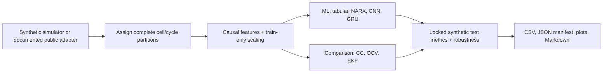
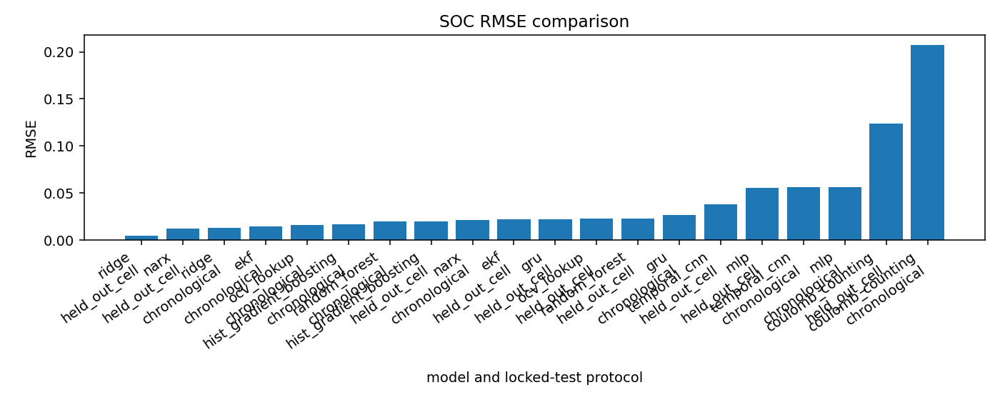
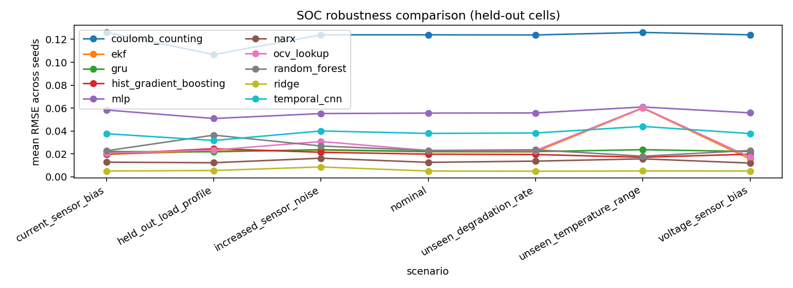
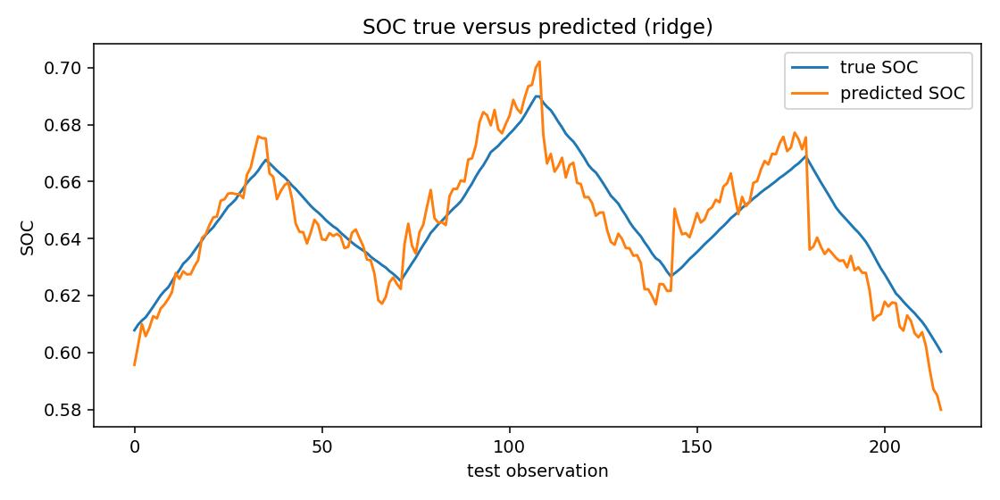
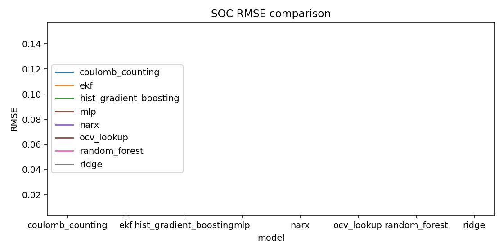
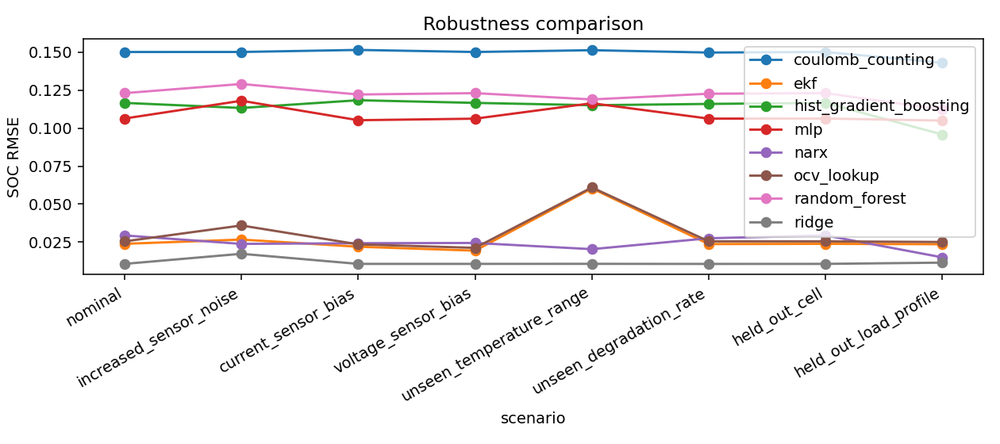

# Battery SOC and SOH Machine Learning Benchmark

[](https://github.com/spicyital/battery-ml-benchmark/actions/workflows/ci.yml)

An ML-first, CPU-friendly benchmark for battery state-of-charge (SOC) time-series estimation and cycle-level state-of-health (SOH) regression. It is designed as a reproducible portfolio project for machine-learning, applied-science, battery analytics, automotive, robotics, and energy-systems roles.

> **This repository uses synthetic or explicitly permitted public data. It does not contain proprietary university, employer, student, or unpublished research data.**

## Estimators

| Category | Estimators | Public-result status |
| --- | --- | --- |
| ML included in the quick benchmark | Ridge, Random Forest, Histogram Gradient Boosting, MLP, NARX | Included in committed synthetic quick results |
| Engineering comparison baselines | Coulomb counting, OCV lookup, one-state EKF | Included in committed synthetic quick results |
| Sequence ML | Causal 1D CNN, GRU | Included in the Version 1 full benchmark; excluded from quick CI results |

CNN and GRU are deliberately excluded from the fast CI/quick configuration. Do not interpret the committed metric tables as CNN/GRU benchmark results.



## Leakage prevention

- No random row-level train/test split: partitions hold out complete cells or later complete cycles.
- Splits occur before feature construction and scaling; scalers fit training rows only.
- Lags, rolling statistics, derivatives, and cumulative features use current/past sensor observations only.
- CNN/GRU windows contain a history ending one timestep before their prediction target.
- ML features exclude simulator-only true SOC/SOH, capacity, resistance, and cycle-start SOC fields.
- NARX uses teacher forcing only while fitting; recursive test inference feeds prior predictions, never test targets.

Details: [leakage-prevention.md](docs/leakage-prevention.md).

## Installation

Python 3.11 or newer is required.

```bash
python -m venv .venv
.venv\Scripts\activate
python -m pip install -r requirements.txt
```

The scripts also add the project-local `src/` directory automatically, so they can run from a checkout without an editable install.

## Five-minute quickstart

```bash
python scripts/generate_synthetic_data.py --config configs/quick.yaml
python scripts/train_soc_models.py --config configs/quick.yaml
python scripts/train_soh_models.py --config configs/quick.yaml
python scripts/evaluate_models.py --config configs/quick.yaml
python scripts/generate_report.py --results results
```

`quick.yaml` runs only Ridge, Random Forest, Histogram Gradient Boosting, MLP, NARX, coulomb counting, OCV lookup, and EKF. It remains the fast CI path. The Version 1 CPU release benchmark runs every SOC estimator, three seeds, two locked test protocols, and robustness conditions:

```bash
python scripts/evaluate_models.py --config configs/full_benchmark.yaml
```

The measured local run time was about **254 seconds** (4.2 minutes). `configs/soc_experiment.yaml` and `configs/soh_experiment.yaml` remain focused experiment templates.

## Version 1 full benchmark

All reported benchmark results use generated synthetic battery data and should not be interpreted as validated real-cell performance.

The full release uses seeds 11, 42, and 73; held-out-cell and chronological held-out-cycle tests; validation-only neural checkpoint selection; and seven controlled robustness conditions. The table shows the held-out-cell aggregate (mean ± standard deviation across seeds), selected from committed `results/full` CSVs.

| Task | Model | RMSE mean ± std | R² mean |
| --- | --- | ---: | ---: |
| SOC | Ridge | 0.005063 ± 0.000000 | 0.977374 |
| SOC | NARX | 0.012648 ± 0.001232 | 0.857906 |
| SOC | EKF | 0.021880 ± 0.000000 | 0.577441 |
| SOC | GRU | 0.022082 ± 0.006303 | 0.431057 |
| SOC | Temporal CNN | 0.037898 ± 0.009790 | -0.660160 |
| SOC | Coulomb counting | 0.123930 ± 0.000000 | -12.556638 |
| SOH | Random Forest | 0.001854 ± 0.000146 | 0.992044 |
| SOH | Ridge | 0.002544 ± 0.000000 | 0.985074 |

Ridge was the strongest held-out-cell SOC estimator in this synthetic run; Random Forest was the strongest SOH estimator. The EKF remained competitive on SOC, while the compact neural models did not materially improve on the simpler methods at this training budget. See the [full benchmark interpretation](docs/full-benchmark-results.md), [aggregate metrics](results/full/soc_metrics_summary.csv), and [robustness metrics](results/full/robustness_metrics.csv) for the complete record.





## Current committed quick results

All figures and tables below are generated from synthetic data using `configs/quick.yaml`; they are methodology comparisons, not real-battery accuracy claims.

| Task | Model | RMSE | MAE | R2 |
| --- | --- | ---: | ---: | ---: |
| SOC | Ridge | 0.010643 | 0.008990 | 0.694956 |
| SOC | Random Forest | 0.123091 | 0.112844 | -39.804726 |
| SOC | Histogram Gradient Boosting | 0.116671 | 0.106213 | -35.659184 |
| SOC | MLP | 0.106367 | 0.082255 | -29.469935 |
| SOC | NARX | 0.029382 | 0.025676 | -1.324953 |
| SOC | Coulomb counting | 0.150191 | 0.147377 | -59.749977 |
| SOC | OCV lookup | 0.025463 | 0.019725 | -0.746145 |
| SOC | EKF | 0.023860 | 0.018041 | -0.533235 |
| SOH | Ridge | 0.007497 | 0.006559 | 0.745378 |
| SOH | Random Forest | 0.008533 | 0.007967 | 0.670179 |
| SOH | Histogram Gradient Boosting | 0.015887 | 0.013475 | -0.143324 |
| SOH | MLP | 0.061842 | 0.040359 | -16.323479 |

Exact generated CSVs, including run-specific runtime measurements, and the manifest are under [results/](results/).







## Testing and reproducibility

```bash
ruff format --check .
ruff check .
pytest -q
```

YAML configurations record simulator parameters, split strategy, seeds, features, enabled models, and training limits. The manifest records the configuration, data provenance, generated artifacts, and Git commit SHA when available. Full CSVs retain per-seed metrics, test sample counts, hyperparameters, and training/inference runtimes.

## Intended use and limitations

Intended for ML-method comparison, time-series evaluation practice, and portfolio demonstration. It is not a battery-management-system controller, safety-certified estimator, warranty tool, or substitute for validation on licensed representative measurements. The synthetic-to-real gap, calibration, uncertainty, pack-level effects, and sensor-fault behavior remain open work.

## Privacy and provenance

This public benchmark uses generated synthetic data only. It contains no WRepo, student, employer, proprietary university, credential, personal, or unpublished research data. Public-data adapters require documented source and license metadata before use.

A résumé-ready project summary is available in [docs/resume-summary.md](docs/resume-summary.md).
