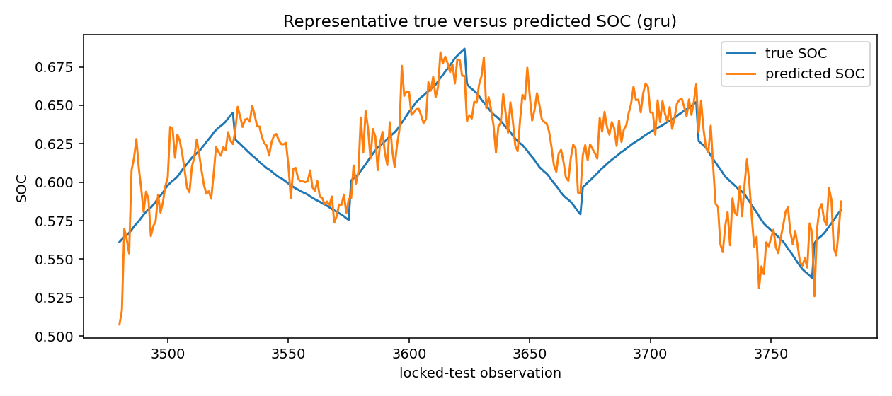

# Version 1 full benchmark results

All values in this document come from generated synthetic battery data using `configs/full_benchmark.yaml`. They compare implementations and protocols in this repository, but they do **not** establish real-cell or deployable battery-management-system accuracy.

## Protocol

The release generated one deterministic six-cell, ten-cycle synthetic dataset and used the same data partitions for every model within each protocol. It ran seeds 11, 42, and 73 with two locked test protocols: complete held-out cells and chronological held-out cycles. Transforms fit on training partitions only; features and sequence windows use only available past/current inputs; the SOC target is the following timestep. CNN/GRU checkpoints use validation loss, while NARX uses teacher forcing only while fitting and prior predictions during recursive test inference. The final test metrics were not used for model selection.

The complete CPU run took **253.6 seconds** locally, including 60 SOC per-seed/protocol rows, 24 SOH rows, and 210 robustness rows. Exact per-seed values, configuration, hyperparameters, runtimes, and provenance are in [`../results/full/`](../results/full/).

## Three-seed held-out-cell summary

| Task | Model | RMSE mean ± std | R² mean | Interpretation |
| --- | --- | ---: | ---: | --- |
| SOC | Ridge | 0.005063 ± 0.000000 | 0.977374 | Strongest held-out-cell SOC result in this synthetic run. |
| SOC | NARX | 0.012648 ± 0.001232 | 0.857906 | Strong recursive ML result, with substantially higher inference cost. |
| SOC | Histogram Gradient Boosting | 0.019767 ± 0.000000 | 0.655127 | Competitive tabular nonlinear estimator. |
| SOC | EKF | 0.021880 ± 0.000000 | 0.577441 | Engineering baseline remained competitive with several learned models. |
| SOC | GRU | 0.022082 ± 0.006303 | 0.431057 | Lightweight sequence model showed seed sensitivity. |
| SOC | OCV lookup | 0.022939 ± 0.000000 | 0.535554 | Fast voltage-only baseline. |
| SOC | Random Forest | 0.022990 ± 0.000865 | 0.533040 | Reasonable but slower tabular baseline. |
| SOC | Temporal CNN | 0.037898 ± 0.009790 | -0.660160 | Compact causal CNN underperformed the simpler models here. |
| SOC | MLP | 0.055624 ± 0.000627 | -1.731209 | Poor held-out-cell generalization. |
| SOC | Coulomb counting | 0.123930 ± 0.000000 | -12.556638 | Drift-prone comparison baseline under synthetic mismatch. |
| SOH | Random Forest | 0.001854 ± 0.000146 | 0.992044 | Strongest held-out-cell SOH result. |
| SOH | Ridge | 0.002544 ± 0.000000 | 0.985074 | Nearly as accurate and dramatically simpler. |
| SOH | Histogram Gradient Boosting | 0.010291 ± 0.000000 | 0.755799 | Moderate degradation-feature fit. |
| SOH | MLP | 0.085430 ± 0.015569 | -16.203061 | Clear generalization weakness. |

Engineering estimators are SOC-only by design; this synthetic SOH task evaluates cycle-summary ML regressors. Complete tables include held-out-cell and chronological metrics, sample counts, MAE, maximum error, bias, MAPE where defined, SOC slices, and per-seed runtimes.

## Accuracy, runtime, and robustness

Ridge was both the best held-out-cell SOC model and one of the fastest learned methods in this synthetic setup. NARX improved over the EKF on held-out cells but incurred about one second of recursive inference per test set. The CNN and GRU were actually trained and recorded, but neither materially improved over Ridge, NARX, or the EKF at this compact CPU budget. The GRU had visible seed variability; the CNN and MLP had weak held-out-cell R², which is an overfitting/generalization warning rather than a claim about neural sequence methods in general.

The EKF and OCV lookup were strong low-cost comparison baselines. Coulomb counting was weakest because fixed nominal assumptions accumulated mismatch and bias. Under increased measurement noise, Ridge held-out-cell RMSE increased from 0.0051 to 0.0086 and NARX from 0.0126 to 0.0162. The unseen-temperature condition affected the EKF most strongly in this set (0.0219 to 0.0600 RMSE), while Ridge remained near 0.0051. Current/voltage biases, the pulse load profile, and altered degradation rate are in [`robustness_metrics.csv`](../results/full/robustness_metrics.csv); no statistical-significance claim is made from three seeds.

## Figures

## Limitations

The simulator has deliberately limited physics, chemistry variation, ageing mechanisms, sensor faults, pack topology, sampling irregularity, and operational confounders. Synthetic splits can only test synthetic distribution shifts. Before any real-world claim, this project needs an explicitly licensed dataset, independently defined labels, calibration and uncertainty analysis, pack-level testing, safety analysis, and held-out deployment-like validation.
